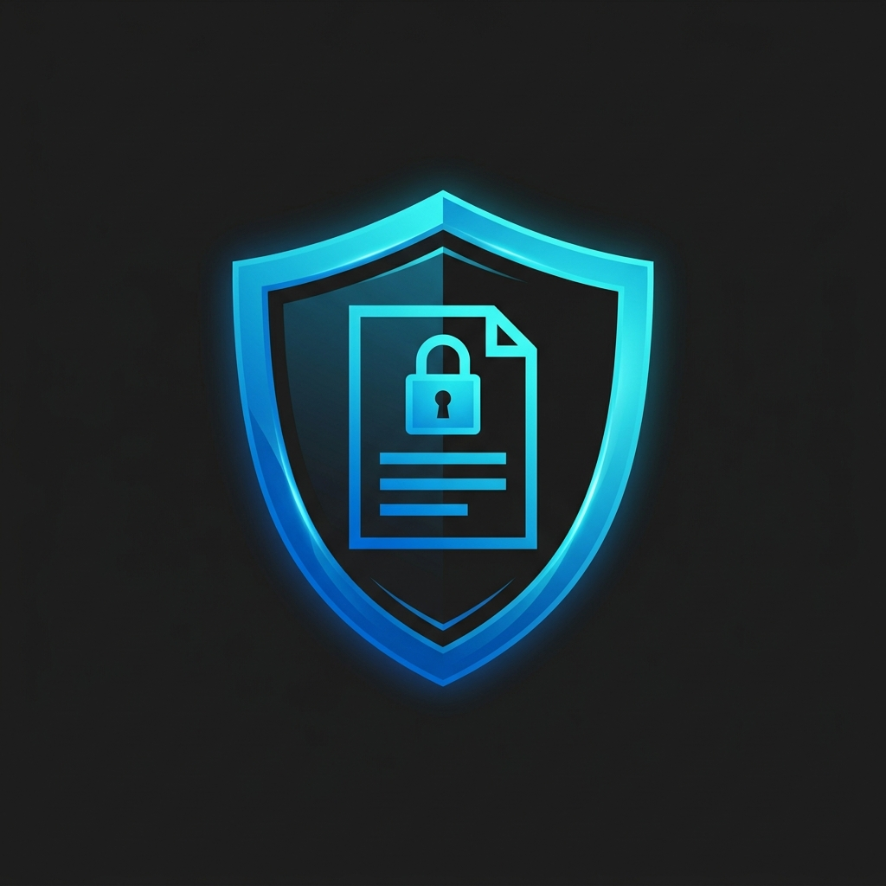

<p align="center">
  
</p>

# Nextcloud Secure Office

[](https://apps.nextcloud.com/apps/secure_office)
[](https://nextcloud.com/)
[](LICENSE)
[%20Alto-green.svg)](https://www.ccn-cert.cni.es/ens.html)

**Nextcloud Secure Office** is an enterprise-grade security extension for Nextcloud 33+ designed to enforce data confidentiality, document traceability, at-rest cryptographic protection, and Data Loss Prevention (DLP) across collaborative office sessions powered by Nextcloud Office (Collabora Online / CODE).

The application is architected to address the rigorous compliance demands of public administrations, critical infrastructure, and highly regulated entities operating under security frameworks such as the Spanish **Esquema Nacional de Seguridad (ENS - Real Decreto 311/2022)**.

---

## ENS Compliance Mapping (RD 311/2022)

| ENS Measure | Security Dimension | Secure Office Implementation |
| :--- | :--- | :--- |
| **`[mp.info.2]`** | **Activity Logging & Traceability** | Automated, immutable audit trail recording every document access in `oc_secure_office_audit` with user ID, client IP, document metadata, classification, and DLP state. Includes CSV export for security audits. |
| **`[mp.info.3]`** | **Storage Encryption (At Rest)** | Full compatibility with Nextcloud Server-Side Encryption (SSE) using Master Key mode (AES-256-CTR). Protects raw document files on disk while maintaining seamless, secure collaborative editing in Collabora. |
| **`[mp.info.4]`** | **Channel Protection (In Transit)** | Enforces and audits secure TLS/HTTPS transit across browser sessions and Collabora WOPI endpoints. |
| **`[mp.info.6]`** | **Information Leak Prevention (DLP)** | Dynamic, non-removable forensic watermarking (`WatermarkText`) displaying user identity, client IP, and timestamps. Enforces `DisableExport`, `DisableCopy`, and `DisablePrint` controls. |

---

## How It Works

Nextcloud Secure Office operates as a transparent security middleware and policy engine between Nextcloud core, the Nextcloud Office application (`richdocuments`), and the Collabora Online (CODE) rendering server:

```text
┌─────────────────────────────────────────────────────────────────────────┐
│                          USER BROWSER / CLIENT                          │
└────────────────────────────────────┬────────────────────────────────────┘
                                     │ 1. User opens collaborative doc
                                     ▼
┌─────────────────────────────────────────────────────────────────────────┐
│                             NEXTCLOUD CORE                              │
│                                                                         │
│  • Storage at Rest: AES-256-CTR Encrypted File on Disk [mp.info.3]     │
│  • Master Key Decryption in RAM for Authenticated Stream                │
└────────────────────────────────────┬────────────────────────────────────┘
                                     │ 2. Collabora requests WOPI CheckFileInfo
                                     ▼
┌─────────────────────────────────────────────────────────────────────────┐
│                      SECURE OFFICE INTERCEPTOR                          │
│                                                                         │
│  • WopiSecurityMiddleware: Intercepts checkFileInfo manifest           │
│  • Injects Dynamic Forensic Watermark Text [mp.info.6]                 │
│  • Injects DLP Flags: DisableExport, DisableCopy, DisablePrint         │
│  • DocumentOpenedListener: Records event to oc_secure_office_audit     │
└────────────────────────────────────┬────────────────────────────────────┘
                                     │ 3. Delivers enriched security manifest
                                     ▼
┌─────────────────────────────────────────────────────────────────────────┐
│                      COLLABORA ONLINE ENGINE (CODE)                     │
│                                                                         │
│  • Renders Diagonal Forensic Watermark across all pages/slides/sheets   │
│  • Disables Download/Export buttons and Export options in UI            │
│  • Disables Browser-level Copy/Paste exfiltration from document canvas   │
│  • Disables Physical & Virtual Printing capabilities                   │
└─────────────────────────────────────────────────────────────────────────┘
```

### 1. WOPI Protocol Interception (`WopiSecurityMiddleware`)
- Collabora Online connects to Nextcloud using the Microsoft-standard **WOPI** (Web Application Open Platform Interface) protocol.
- When a document is opened, Collabora calls the `checkFileInfo` endpoint (`GET /wopi/files/{fileId}`) to query file metadata, permissions, and editor capabilities.
- `WopiSecurityMiddleware` hooks into Nextcloud's controller lifecycle (`afterController`). It intercepts the response before it reaches Collabora and dynamically injects:
  - `WatermarkText`: An indelible forensic stamp constructed from dynamic tokens (`{classification}`, `{userDisplayName}`, `{userId}`, `{userIp}`, `{date}`).
  - DLP flags: `DisableExport: true`, `DisableCopy: true`, `DisablePrint: true`, `HideExportOption: true`, `HidePrintOption: true`.
- Collabora's rendering engine natively interprets these parameters, superimposing the forensic watermark directly into the rendered canvas and removing download/print/copy actions from the user interface.

### 2. At-Rest Cryptographic Protection (`[mp.info.3]`)
- By leveraging Nextcloud's Server-Side Encryption (SSE) in **Master Key** mode (`OC_DEFAULT_MODULE`), document files stored on server storage (`/var/www/html/data/`) are stored as **AES-256-CTR** ciphertext (`HBEGIN:oc_encryption_module:OC_DEFAULT_MODULE...`).
- When an authorized user collaborates on a file, Nextcloud decodes the stream in memory using the system Master Key, delivers the decrypted stream to Collabora over a secure internal channel, and immediately re-encrypts changes before saving back to physical storage.

### 3. Immutable Database Audit Trail (`[mp.info.2]`)
- Every collaborative session emits `OCA\Richdocuments\Events\DocumentOpenedEvent`.
- `DocumentOpenedListener` captures this event and dispatches it to `AuditService`, creating an immutable audit record in the `oc_secure_office_audit` database table.
- Each record registers: timestamp (UTC), user ID, origin IP address, document ID, file name, file path, classification level, and applied DLP controls.
- Administrators can review recent access events in the web UI and download the complete audit trail as a standard CSV file for formal audits.

### 4. Continuous ENS Compliance Engine & CLI Auditor
- `EnsDiagnosticService` continuously checks the operational state of all four ENS measures.
- Security officers can inspect system compliance in the administration interface or via terminal with `php occ secure_office:ens-audit`.

---

## Key Features & Security Capabilities

- **Dynamic Forensic Watermarking**:
  - Automatically embeds dynamic, non-removable background watermarks in real-time during Collabora Online editing and viewing sessions.
  - Configurable watermark payloads include authenticated user identifier (`{userId}`), display name (`{userDisplayName}`), client IP address (`{userIp}`), access timestamp, and document confidentiality classification labels (e.g., `CONFIDENCIAL (ENS RD 311/2022)`).
  - Acts as a forensic deterrent against data leakage through screen captures, photographs, or unauthorized redistribution.

- **Data Loss Prevention (DLP) Controls**:
  - **Export Restriction**: Prohibits users from exporting or downloading unencrypted document copies (`DisableExport`) while preserving in-browser collaborative editing.
  - **Clipboard Isolation**: Enforces copy/paste restrictions (`DisableCopy`) to prevent exfiltration of sensitive document text outside the secure perimeter.
  - **Print Prohibition**: Blocks physical and virtual printing actions (`DisablePrint`) within the office suite interface.

- **Administrative Security Control Panel**:
  - Integrated into Nextcloud Settings under **Settings > Administration > Security**.
  - Displays a real-time ENS compliance dashboard evaluating all active security controls.
  - Allows security officers to adjust classification labels, watermark tokens, and DLP switches with immediate effect.
  - Provides a searchable audit log with direct **CSV export** capabilities.

- **CLI Diagnostic Auditor (`occ`)**:
  - Run instant compliance evaluations from the terminal:
    ```bash
    php occ secure_office:ens-audit
    ```

---

## Architecture & Directory Structure

```text
custom_apps/secure_office/
├── appinfo/
│   ├── info.xml            # App metadata, settings, commands, and dependencies
│   └── routes.php          # REST and UI routing definitions
├── lib/
│   ├── AppInfo/
│   │   └── Application.php # Application bootstrap and service registration
│   ├── Command/
│   │   └── EnsAuditCommand.php # CLI auditor (occ secure_office:ens-audit)
│   ├── Controller/
│   │   ├── PageController.php         # Public status and overview endpoints
│   │   └── SettingsApiController.php  # Admin REST API for policies and CSV export
│   ├── Listener/
│   │   └── DocumentOpenedListener.php # Nextcloud Office audit event listener
│   ├── Middleware/
│   │   └── WopiSecurityMiddleware.php # WOPI CheckFileInfo security interceptor
│   ├── Migration/
│   │   └── Version020000Date...php    # Database schema for oc_secure_office_audit
│   ├── Service/
│   │   ├── AuditService.php           # Audit persistence and CSV export service
│   │   ├── EnsDiagnosticService.php   # Real-time ENS compliance engine
│   │   └── SecurityConfigService.php  # Policy and configuration manager
│   └── Settings/
│       └── AdminSettings.php          # Nextcloud admin settings integration
├── templates/
│   ├── admin.php           # Security administration dashboard template
│   └── main.php            # Standalone view template
├── LICENSE                 # GNU AGPL-3.0 with attribution notice
└── README.md               # Documentation
```

---

## Requirements

- **Nextcloud**: `>= 33.0.0`
- **PHP**: `>= 8.2`
- **Nextcloud Office (`richdocuments`)**: Enabled
- **Collabora Online (CODE)**: Running and configured as the document processing engine
- **Server-Side Encryption (`encryption`)**: Enabled with Master Key for `[mp.info.3]` compliance

---

## Installation & Setup

1. Place this repository into your Nextcloud `custom_apps` directory:
   ```bash
   cd /var/www/html/custom_apps/
   git clone https://github.com/nmarafo/nextcloud-secure-office.git secure_office
   ```

2. Enable the application:
   ```bash
   php occ app:enable secure_office
   ```

3. Enable At-Rest Encryption with Master Key (ENS `[mp.info.3]`):
   ```bash
   php occ app:enable encryption
   php occ encryption:enable-master-key
   php occ encryption:enable
   php occ encryption:encrypt-all
   ```

4. Run the ENS compliance audit:
   ```bash
   php occ secure_office:ens-audit
   ```

---

## Disclaimer / Descargo de Responsabilidad

> [!IMPORTANT]
> **Legal, Regulatory & Security Disclaimer:**
>
> 1. **"AS IS" Software**: This software is provided by the author and contributors "as is", without warranty of any kind, express or implied, including but not limited to the warranties of merchantability, fitness for a particular purpose, and non-infringement. In no event shall the author or copyright holders be liable for any claim, damages, data loss, security incident, or other liability arising from the use of or inability to use this software.
>
> 2. **ENS Accreditation & Certification**: While **Nextcloud Secure Office** implements technical security controls, DLP restrictions, cryptographic compatibility, and audit logging designed to support and facilitate compliance with Spain's **Esquema Nacional de Seguridad (ENS - Real Decreto 311/2022)**, the mere installation or activation of this plugin does **not** constitute an official ENS certification or guarantee formal compliance.
>
> 3. **Administrative & Organizational Responsibility**: ENS compliance encompasses broad organizational, physical, technical, and operational dimensions. The deploying organization and its designated Security Officer (CISO / Responsable de Seguridad) are solely responsible for:
>    - Conducting comprehensive security and risk assessments.
>    - Ensuring appropriate server hardening, network segmentation, and perimeter defense.
>    - Enforcing mandatory TLS/HTTPS encryption with trusted certificates (`[mp.info.4]`).
>    - Managing cryptographic key security and backup lifecycles (`[mp.info.3]`).
>    - Establishing incident response protocols, access governance, and formal security policies.
>
> **Descargo de Responsabilidad (Español):**  
> El presente software se distribuye "tal cual", sin garantías de ningún tipo. La utilización de este complemento facilita la implementación técnica de medidas de seguridad recogidas en el **Esquema Nacional de Seguridad (Real Decreto 311/2022)**, pero **no sustituye ni otorga por sí misma la certificación formal de conformidad con el ENS**. La responsabilidad sobre la adecuación, gestión de claves criptográficas, aseguramiento de canales TLS, políticas de seguridad y auditorías preceptivas recae exclusivamente en la entidad u organismo implantador.

---

## Author & Attribution

- **Author**: Norberto Martín Afonso ([normaafo@gmail.com](mailto:normaafo@gmail.com))
- **Repository**: [https://github.com/nmarafo/nextcloud-secure-office](https://github.com/nmarafo/nextcloud-secure-office)

---

## License

This project is licensed under the **GNU Affero General Public License v3.0 (AGPL-3.0-or-later)** with author attribution preserved under Section 7(b).

See the [LICENSE](LICENSE) file for complete licensing terms and attribution requirements.