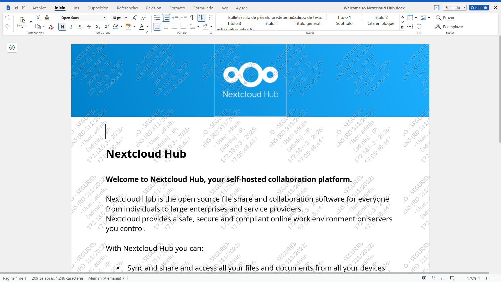
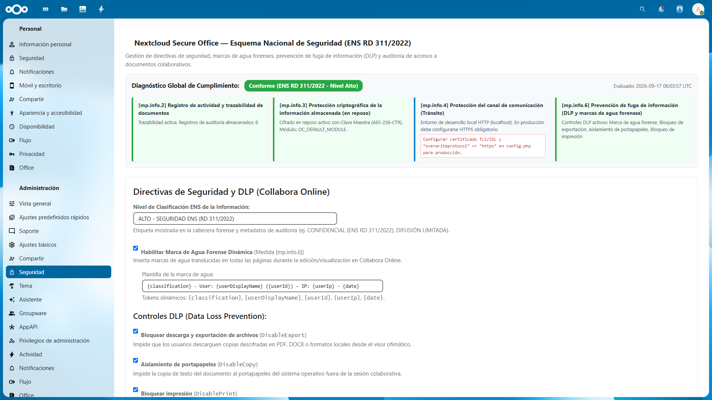
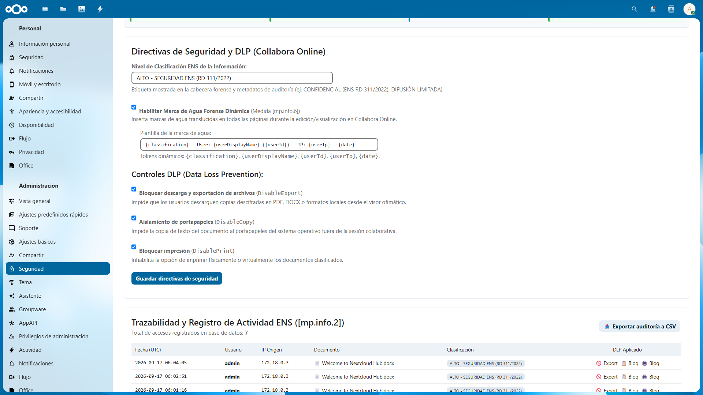
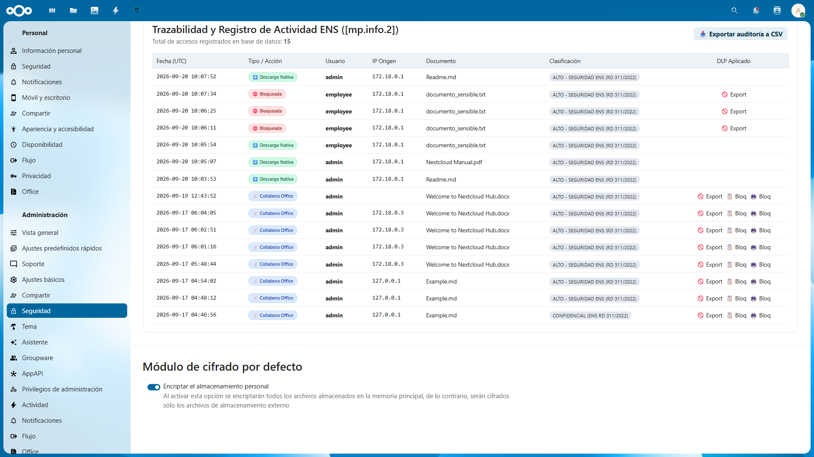
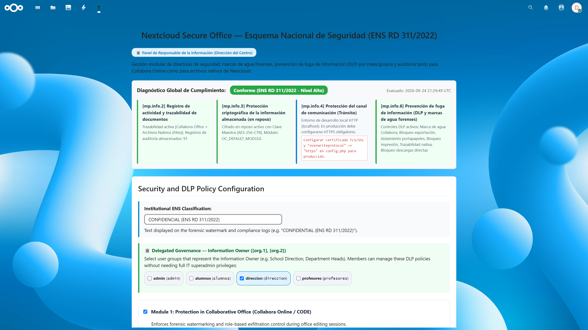
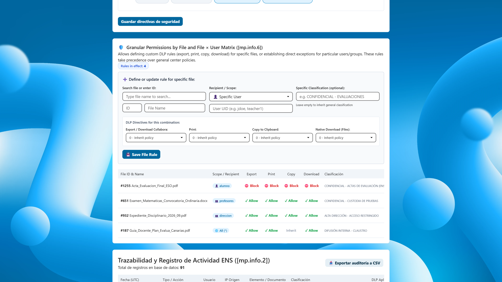
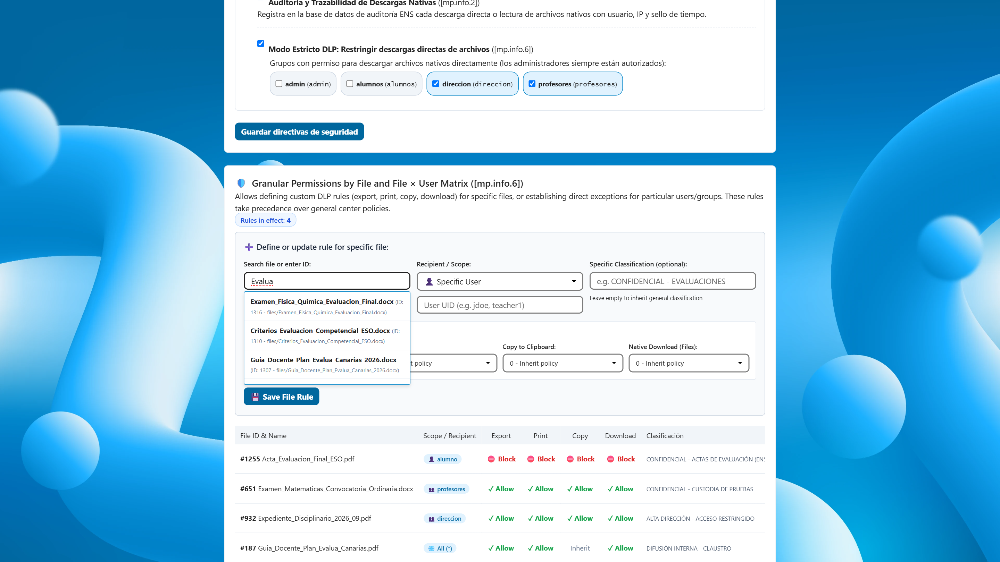
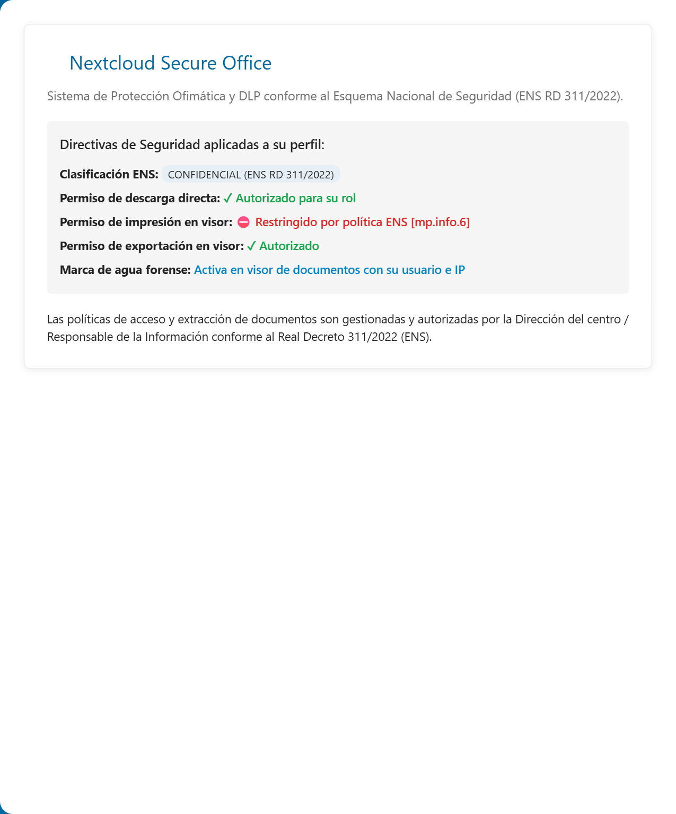
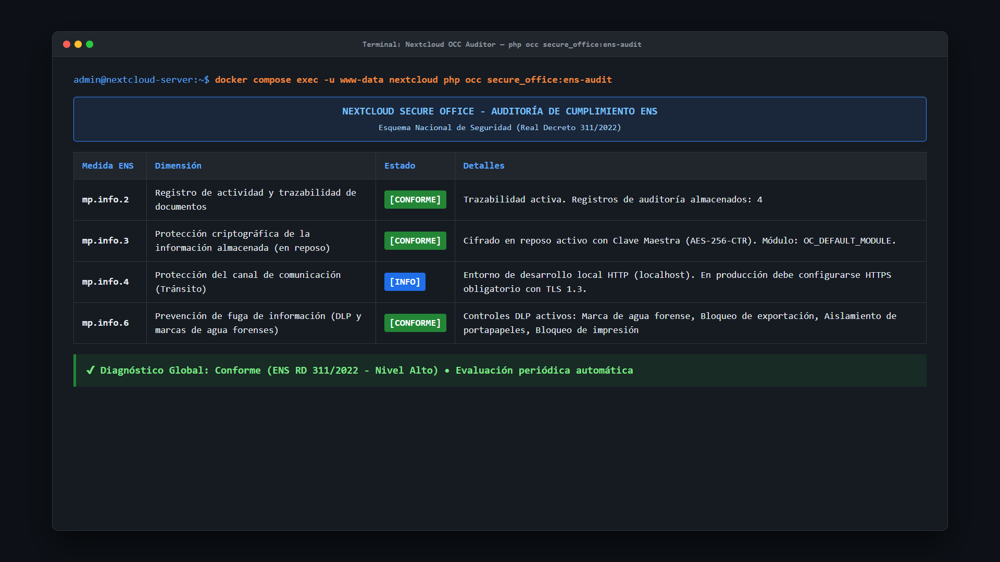

<p align="center">
  
</p>

# Nextcloud Secure Office

[](https://apps.nextcloud.com/apps/secure_office)
[](https://github.com/nmarafo/nextcloud-secure-office/releases)
[](https://nextcloud.com/)
[](LICENSE)
[%20Alto-green.svg)](https://www.ccn-cert.cni.es/ens.html)
[](https://www.ccn-cert.cni.es/es/800-guia-esquema-nacional-de-seguridad/4229-ccn-stic-826-implementacion-de-seguridad-nextcloud/file.html)

**Nextcloud Secure Office** is an enterprise-grade security extension for Nextcloud 33+ designed to enforce data confidentiality, document traceability, cryptographic protection at rest, granular role-based Data Loss Prevention (DLP), and delegated security governance across collaborative office documents (Collabora Online / CODE) and native Nextcloud files (PDFs, images, archives).

The application is specifically architected to address the rigorous compliance demands of public administrations, educational institutions, critical infrastructure, and regulated entities operating under security frameworks such as Spain's **Esquema Nacional de Seguridad (ENS - Real Decreto 311/2022)** and the technical baseline established in **[CCN-STIC-826: Implementación de Seguridad Nextcloud](https://www.ccn-cert.cni.es/es/800-guia-esquema-nacional-de-seguridad/4229-ccn-stic-826-implementacion-de-seguridad-nextcloud/file.html)**.

---

## 📸 Visual Showcase & Screenshot Carousel

<div align="center">

> 💡 **Interactive Carousel**: Click any thumbnail or slide title below to expand and inspect high-resolution interfaces, policy settings, and compliance dashboards.

<table>
  <tr>
    <td align="center" width="11%">
      <a href="#slide-1-collabora-forensic-watermark">
        <br>
        <sub><b>1. Watermark</b></sub>
      </a>
    </td>
    <td align="center" width="11%">
      <a href="#slide-2-ens-compliance-dashboard">
        <br>
        <sub><b>2. ENS Cards</b></sub>
      </a>
    </td>
    <td align="center" width="11%">
      <a href="#slide-3-role-based-dlp-settings">
        <br>
        <sub><b>3. DLP Policy</b></sub>
      </a>
    </td>
    <td align="center" width="11%">
      <a href="#slide-4-audit-trail-traceability">
        <br>
        <sub><b>4. Audit Trail</b></sub>
      </a>
    </td>
    <td align="center" width="11%">
      <a href="#slide-5-delegated-director-governance">
        <br>
        <sub><b>5. Direction</b></sub>
      </a>
    </td>
    <td align="center" width="11%">
      <a href="#slide-8-granular-file-matrix">
        <br>
        <sub><b>6. File Matrix</b></sub>
      </a>
    </td>
    <td align="center" width="11%">
      <a href="#slide-9-predictive-file-search">
        <br>
        <sub><b>7. File Search</b></sub>
      </a>
    </td>
    <td align="center" width="11%">
      <a href="#slide-6-user-transparency-view">
        <br>
        <sub><b>8. User View</b></sub>
      </a>
    </td>
    <td align="center" width="11%">
      <a href="#slide-7-terminal-cli-auditor">
        <br>
        <sub><b>9. Terminal CLI</b></sub>
      </a>
    </td>
  </tr>
</table>

</div>

---

### <a id="slide-1-collabora-forensic-watermark"></a>
<details open>
<summary><b>🎞️ Slide 1: Dynamic Forensic Watermarking (Collabora Online)</b> <i>[Click to toggle]</i></summary>
<br>
<p align="center">
  <a href="screenshots/01_collabora_forensic_watermark.png">
    
  </a>
</p>
<blockquote>
<b>Indelible real-time forensic watermark:</b> Dynamically renders user identity, client IP address, date/time, and ENS classification across the document canvas in Collabora Online. Protects against screenshots, illicit exports, and physical camera captures (ENS [mp.info.6], CCN-STIC-826).
</blockquote>
</details>

### <a id="slide-2-ens-compliance-dashboard"></a>
<details>
<summary><b>🎞️ Slide 2: ENS RD 311/2022 Real-Time Compliance Dashboard</b> <i>[Click to toggle]</i></summary>
<br>
<p align="center">
  <a href="screenshots/02_admin_ens_cards.png">
    
  </a>
</p>
<blockquote>
<b>Continuous compliance verification:</b> Live diagnostic status cards actively monitoring critical ENS dimensions: <code>[mp.info.2]</code> (Activity Logging), <code>[mp.info.3]</code> (At-Rest AES-256-CTR Master Key Encryption), <code>[mp.info.4]</code> (TLS Channel Transit), and <code>[mp.info.6]</code> (DLP Enforcement).
</blockquote>
</details>

### <a id="slide-3-role-based-dlp-settings"></a>
<details>
<summary><b>🎞️ Slide 3: Role-Based DLP & Delegated Governance Settings</b> <i>[Click to toggle]</i></summary>
<br>
<p align="center">
  <a href="screenshots/03_admin_dlp_settings.png">
    
  </a>
</p>
<blockquote>
<b>Granular DLP policy engine:</b> Group-based selectors for Collabora download/export, print, copy-paste clipboard restriction, and native file download prevention. Includes Delegated Administrator assignment for institutional leadership (ENS [org.1], [org.2]).
</blockquote>
</details>

### <a id="slide-4-audit-trail-traceability"></a>
<details>
<summary><b>🎞️ Slide 4: Activity Audit Trail & Policy Traceability Log</b> <i>[Click to toggle]</i></summary>
<br>
<p align="center">
  <a href="screenshots/04_admin_audit_table.png">
    
  </a>
</p>
<blockquote>
<b>Immutable forensic ledger:</b> High-resolution event logging recording all document accesses, native file downloads, exfiltration blocks, and administrative policy changes (<code>POLICY_CHANGE</code>) with IP, user ID, and timestamp. Fully exportable to CSV for ENS compliance audits (ENS [mp.info.2]).
</blockquote>
</details>

### <a id="slide-5-delegated-director-governance"></a>
<details>
<summary><b>🎞️ Slide 5: Delegated Governance Panel (Dirección del Centro)</b> <i>[Click to toggle]</i></summary>
<br>
<p align="center">
  <a href="screenshots/06_delegated_director_dashboard.png">
    
  </a>
</p>
<blockquote>
<b>Segregation of duties & institutional governance:</b> Dedicated management view for the <b>Responsable de la Información</b> (School Director / Department Head) to adjust DLP policies and audit organizational activity without IT superadmin credentials (ENS [org.1], [org.2], [mp.ac.3]).
</blockquote>
</details>

### <a id="slide-8-granular-file-matrix"></a>
<details>
<summary><b>🎞️ Slide 6: Granular File-Level & File × User Matrix (v0.5.0)</b> <i>[Click to toggle]</i></summary>
<br>
<p align="center">
  <a href="screenshots/08_granular_file_matrix.png">
    
  </a>
</p>
<blockquote>
<b>Pinpoint security exceptions and per-file DLP:</b> Define custom rules for individual sensitive documents (e.g. <code>Acta_Evaluacion_Final_ESO.pdf</code>, <code>Examen_Matematicas.docx</code>) and specific users or groups. Granular directives (+1 Allow, -1 Block, 0 Inherit) override general center policies with sub-second resolution across Collabora Online and Nextcloud Files (ENS [mp.info.6]).
</blockquote>
</details>

### <a id="slide-9-predictive-file-search"></a>
<details>
<summary><b>🎞️ Slide 7: Predictive File Search & Live Cache Autocomplete (v0.5.0)</b> <i>[Click to toggle]</i></summary>
<br>
<p align="center">
  <a href="screenshots/09_file_search_predictive.png">
    
  </a>
</p>
<blockquote>
<b>Effortless document rule assignment:</b> Live debounced autocomplete queries Nextcloud's filecache directly, instantly presenting matched files, internal paths, and numeric IDs. Directors and managers can select files in one click without browsing technical folder trees.
</blockquote>
</details>

### <a id="slide-6-user-transparency-view"></a>
<details>
<summary><b>🎞️ Slide 8: End-User Policy Transparency View</b> <i>[Click to toggle]</i></summary>
<br>
<p align="center">
  <a href="screenshots/07_user_transparency_view.png">
    
  </a>
</p>
<blockquote>
<b>Transparency for end-users:</b> Clear overview in user settings for teachers, administrative staff, and students showing active session restrictions, forensic watermarking status, and applied organizational policies.
</blockquote>
</details>

### <a id="slide-7-terminal-cli-auditor"></a>
<details>
<summary><b>🎞️ Slide 9: Terminal Compliance Auditor CLI</b> <i>[Click to toggle]</i></summary>
<br>
<p align="center">
  <a href="screenshots/05_terminal_ens_audit.png">
    
  </a>
</p>
<blockquote>
<b>Automated command-line auditing:</b> Instant verification via <code>php occ secure_office:ens-audit</code> returning exact compliance scores, check passes/failures, and recommendations for CI/CD or server health monitoring.
</blockquote>
</details>

---

## ENS & CCN-STIC-826 Compliance Mapping (RD 311/2022)

| ENS Measure / STIC Ref | Security Dimension | Gaps Resolved by Secure Office Implementation |
| :--- | :--- | :--- |
| **`[org.1]`**<br>**`[org.2]`**<br>**`[mp.ac.3]`** | **Segregation of Duties & Delegated Governance** | Implements the role of **Responsable de la Información** (e.g. School Director, Department Head). Allows institutional managers to govern download, export, and print permissions per user group without requiring global IT superadmin privileges. |
| **`[mp.info.2]`**<br>CCN-STIC-826 | **Activity Logging & Traceability** | Automated, immutable audit trail recording every document access, native file download (PDF, images, ZIPs, binaries), and security policy change (`POLICY_CHANGE`) in `oc_secure_office_audit` with user ID, client IP, document metadata, classification, and DLP state. Includes CSV export for security audits. |
| **`[mp.info.3]`**<br>CCN-STIC-826 | **Storage Encryption (At Rest)** | Full compatibility with Nextcloud Server-Side Encryption (SSE) using Master Key mode (AES-256-CTR). Protects raw document and native files on disk while maintaining seamless, secure collaborative editing in Collabora. |
| **`[mp.info.4]`**<br>CCN-STIC-826 | **Channel Protection (In Transit)** | Enforces and audits secure TLS/HTTPS transit across browser sessions, WebDAV transfers, and Collabora WOPI endpoints. |
| **`[mp.info.6]`**<br>CCN-STIC-826 | **Information Leak Prevention (DLP)** | **Collabora Module:** Dynamic, indelible forensic watermarking (`WatermarkText`) displaying user identity, client IP, and timestamps. Granular role-based controls for `DisableExport`, `DisableCopy`, and `DisablePrint` in Collabora Online.<br>**Native Files Module:** Role-based policy restricting direct file downloads to authorized groups (e.g. Direction, Teachers) while preventing download to unauthorized users (e.g. Students).<br>**Granular File & User Matrix (v0.5.0):** Fine-grained DLP directives per specific file and user/group (+1 Allow, -1 Block, 0 Inherit) overriding global policies, with predictive autocomplete file search. |

---

## How It Works

Nextcloud Secure Office operates as a transparent security middleware and policy engine between Nextcloud core, the Nextcloud Office application (`richdocuments`), and the Collabora Online (CODE) rendering server:

```text
┌─────────────────────────────────────────────────────────────────────────┐
│                          USER BROWSER / CLIENT                          │
└────────────────────────────────────┬────────────────────────────────────┘
                                     │ 1. User opens collaborative doc
                                     ▼
┌─────────────────────────────────────────────────────────────────────────┐
│                             NEXTCLOUD CORE                              │
│                                                                         │
│  • Storage at Rest: AES-256-CTR Encrypted File on Disk [mp.info.3]     │
│  • Master Key Decryption in RAM for Authenticated Stream                │
└────────────────────────────────────┬────────────────────────────────────┘
                                     │ 2. Collabora requests WOPI CheckFileInfo
                                     ▼
┌─────────────────────────────────────────────────────────────────────────┐
│                      SECURE OFFICE INTERCEPTOR                          │
│                                                                         │
│  • WopiSecurityMiddleware: Intercepts checkFileInfo manifest           │
│  • Resolves authenticated user & evaluates assigned groups / roles     │
│  • Injects Dynamic Forensic Watermark Text [mp.info.6]                 │
│  • Injects Granular DLP Flags: DisableExport, DisableCopy, DisablePrint│
│  • DocumentOpenedListener: Records event to oc_secure_office_audit     │
└────────────────────────────────────┬────────────────────────────────────┘
                                     │ 3. Delivers enriched security manifest
                                     ▼
┌─────────────────────────────────────────────────────────────────────────┐
│                      COLLABORA ONLINE ENGINE (CODE)                     │
│                                                                         │
│  • Renders Diagonal Forensic Watermark across all pages/slides/sheets   │
│  • Disables Download/Export buttons dynamically per role / group        │
│  • Disables Clipboard Copy/Paste exfiltration from document canvas      │
│  • Disables Physical & Virtual Printing capabilities per role / group   │
└─────────────────────────────────────────────────────────────────────────┘
```

### 1. WOPI Protocol Interception (`WopiSecurityMiddleware`)
- Collabora Online connects to Nextcloud using the Microsoft-standard **WOPI** (Web Application Open Platform Interface) protocol.
- When a document is opened, Collabora calls the `checkFileInfo` endpoint (`GET /wopi/files/{fileId}`) to query file metadata, permissions, and editor capabilities.
- `WopiSecurityMiddleware` hooks into Nextcloud's controller lifecycle (`afterController`). It intercepts the response before it reaches Collabora, identifies the authenticated user and their groups, and dynamically injects:
  - `WatermarkText`: An indelible forensic stamp constructed from dynamic tokens (`{classification}`, `{userDisplayName}`, `{userId}`, `{userIp}`, `{date}`).
  - Granular DLP flags: `DisableExport`, `DisableCopy`, `DisablePrint`, `HideExportOption`, `HidePrintOption` based on whether the user's role is in the allowed group list.
- Collabora's rendering engine natively interprets these parameters, superimposing the forensic watermark directly into the rendered canvas and removing download/print/copy actions for restricted roles.

### 2. Role-Based Native File Access Control (`NativeFileAccessListener`)
- Monitors native file access and direct downloads via Nextcloud Files or WebDAV (PDFs, images, ZIP archives, binaries).
- Enforces strict mode DLP: users can only download files if they belong to an authorized group configured by the Responsable de la Información (e.g. `direccion`, `profesores`) or are system administrators.
- Unauthorized download attempts are blocked (HTTP 403 / `HintException`) and recorded in the audit database as `BLOCKED_DOWNLOAD`.

### 3. Delegated Governance for Institutional Direction (`[org.1]`, `[org.2]`)
- Under the ENS, the **Responsable de la Información** (in educational centers, the Direction or Leadership Team) has the exclusive authority to determine access and dissemination rights over institutional information.
- Members of configured managerial groups (e.g. `direccion`) can access the Secure Office control panel directly from the top navigation bar, configure allowed groups for each DLP directive, and export compliance reports without requiring global server superadmin privileges.
- Every policy modification is logged in the audit trail as `POLICY_CHANGE`.

### 4. At-Rest Cryptographic Protection (`[mp.info.3]`)
- By leveraging Nextcloud's Server-Side Encryption (SSE) in **Master Key** mode (`OC_DEFAULT_MODULE`), document files stored on server storage (`/var/www/html/data/`) are stored as **AES-256-CTR** ciphertext (`HBEGIN:oc_encryption_module:OC_DEFAULT_MODULE...`).
- When an authorized user collaborates on a file, Nextcloud decodes the stream in memory using the system Master Key, delivers the decrypted stream to Collabora over a secure internal channel, and immediately re-encrypts changes before saving back to physical storage.

### 5. Immutable Database Audit Trail (`[mp.info.2]`)
- Every collaborative session, native file download, blocked exfiltration attempt, and policy change creates an immutable audit record in the `oc_secure_office_audit` database table.
- Each record registers: timestamp (UTC), user ID, origin IP address, document ID, file name, file path, classification level, action type (`COLLABORA_VIEW`, `NATIVE_DOWNLOAD`, `BLOCKED_DOWNLOAD`, `POLICY_CHANGE`), and applied DLP controls.
- Authorized managers and administrators can review access events in the web UI and download the complete audit trail as a standard CSV file for formal audits.

---

## Key Features & Security Capabilities

- **Granular Role-Based Data Loss Prevention (DLP)**:
  - **Export & Download Restriction**: Prohibit unencrypted document downloads in the viewer while permitting in-browser viewing or editing for specified roles.
  - **Printing Restriction**: Block physical and virtual printing actions within the office suite interface per user role.
  - **Clipboard Isolation**: Prevent copying sensitive text out of documents for non-authorized groups.
  - **Native File Download Control**: Restrict direct file downloads in Nextcloud Files to authorized profiles.

- **Granular File-Level & File × User DLP Matrix (`[mp.info.6]`)**:
  - **Per-Document Overrides**: Define explicit export, printing, clipboard, and native download permissions for individual files that override general group policies.
  - **Specific User Exceptions**: Establish tailored security permissions for a particular user (e.g. `teacher1` vs `student2`) on a specific document.
  - **Custom Document Classification**: Assign distinct ENS classification levels (e.g. *CONFIDENCIAL - ACTAS*, *EXPEDIENTES*) to sensitive files with live search and selection.

- **Dynamic Forensic Watermarking**:
  - Automatically embeds dynamic, non-removable background watermarks in real-time during Collabora Online editing and viewing sessions.
  - Configurable tokens: `{classification}`, `{userDisplayName}`, `{userId}`, `{userIp}`, `{date}`.
  - Acts as a forensic deterrent against data leakage through screen captures, photographs, or unauthorized redistribution.

- **Delegated Administration (ENS Responsable de la Información)**:
  - Empowers institutional leadership (School Directors, Department Heads) to manage security policies for their organization.
  - Independent access through the Nextcloud app navigation menu without global IT superadmin privileges.
  - Full traceability: policy modifications are logged with user identity and timestamp.

- **User Transparency View**:
  - Regular users (teachers, staff, students) can access the app view to see clearly and transparently what security classification and DLP policies apply to their profile.

- **CLI Diagnostic Auditor (`occ`)**:
  - Run instant compliance evaluations from the terminal:
    ```bash
    php occ secure_office:ens-audit
    ```

---

## Architecture & Directory Structure

```text
custom_apps/secure_office/
├── appinfo/
│   ├── info.xml            # App metadata, settings, commands, and dependencies
│   ├── routes.php          # REST and UI routing definitions
│   └── signature.json      # Code integrity signature
├── lib/
│   ├── AppInfo/
│   │   └── Application.php # Application bootstrap and service registration
│   ├── Command/
│   │   └── EnsAuditCommand.php # CLI auditor (occ secure_office:ens-audit)
│   ├── Controller/
│   │   ├── PageController.php         # App navigation, delegated view, and user status
│   │   └── SettingsApiController.php  # Admin & delegated REST API for policies and CSV export
│   ├── Listener/
│   │   ├── DocumentOpenedListener.php # Nextcloud Office audit event listener
│   │   └── NativeFileAccessListener.php # Native file access and download DLP listener
│   ├── Middleware/
│   │   └── WopiSecurityMiddleware.php # WOPI CheckFileInfo granular security interceptor
│   ├── Migration/
│   │   ├── Version020000Date...php    # Database schema for oc_secure_office_audit
│   │   └── Version030000Date...php    # Audit enhancements
│   ├── Service/
│   │   ├── AuditService.php           # Audit persistence and CSV export service
│   │   ├── EnsDiagnosticService.php   # Real-time ENS compliance engine
│   │   └── SecurityConfigService.php  # Role-based policy and configuration manager
│   └── Settings/
│       └── AdminSettings.php          # Nextcloud admin settings integration
├── templates/
│   ├── admin.php           # Security administration dashboard template with group selectors
│   └── main.php            # User transparency status view template
├── screenshots/            # Visual documentation and store screenshot assets
├── LICENSE                 # GNU AGPL-3.0 with attribution notice
└── README.md               # Documentation
```

---

## Requirements

- **Nextcloud**: `>= 33.0.0`
- **PHP**: `>= 8.2`
- **Nextcloud Office (`richdocuments`)**: Enabled
- **Collabora Online (CODE)**: Running and configured as the document processing engine
- **Server-Side Encryption (`encryption`)**: Enabled with Master Key for `[mp.info.3]` compliance

---

## Installation & Setup

1. Place this repository into your Nextcloud `custom_apps` directory:
   ```bash
   cd /var/www/html/custom_apps/
   git clone https://github.com/nmarafo/nextcloud-secure-office.git secure_office
   ```

2. Enable the application:
   ```bash
   php occ app:enable secure_office
   ```

3. Enable At-Rest Encryption with Master Key (ENS `[mp.info.3]`):
   ```bash
   php occ app:enable encryption
   php occ encryption:enable-master-key
   php occ encryption:enable
   php occ encryption:encrypt-all
   ```

4. Run the ENS compliance audit:
   ```bash
   php occ secure_office:ens-audit
   ```

---

## Production Deployment Considerations (ENS [mp.info.4] Compliance)

To achieve full compliance in production environments, particularly for communication channel protection (ENS Measure **`[mp.info.4]`** - Tránsito Seguro):

1. **Mandatory HTTPS & TLS Hardening:**
   - Deploy Nextcloud and Collabora Online behind a hardened reverse proxy (e.g. Nginx, Traefik, Apache, or Caddy) equipped with trusted TLS/SSL certificates.
   - Enforce TLS 1.2 or TLS 1.3 with forward secrecy cipher suites.

2. **Nextcloud Protocol Enforcement (`config/config.php`):**
   Ensure Nextcloud enforces HTTPS across all generated URLs, webhooks, and CLI operations:
   ```php
   'overwriteprotocol' => 'https',
   'overwrite.cli.url' => 'https://nextcloud.yourdomain.com',
   ```

3. **HTTP Strict Transport Security (HSTS):**
   Configure your reverse proxy to send the HSTS header:
   ```nginx
   add_header Strict-Transport-Security "max-age=15552000; includeSubDomains; preload" always;
   ```

4. **Secure Collabora WOPI Communication:**
   Configure Nextcloud Office (`richdocuments`) to communicate with Collabora exclusively over HTTPS:
   ```bash
   php occ config:app:set richdocuments wopi_url --value="https://collabora.yourdomain.com"
   ```

---

## Disclaimer / Descargo de Responsabilidad

> [!IMPORTANT]
> **Legal, Regulatory & Security Disclaimer:**
>
> 1. **"AS IS" Software**: This software is provided by the author and contributors "as is", without warranty of any kind, express or implied, including but not limited to the warranties of merchantability, fitness for a particular purpose, and non-infringement. In no event shall the author or copyright holders be liable for any claim, damages, data loss, security incident, or other liability arising from the use of or inability to use this software.
>
> 2. **ENS & CCN-STIC Accreditation & Certification**: While **Nextcloud Secure Office** implements technical security controls, DLP restrictions, cryptographic compatibility, and audit logging designed to support and facilitate compliance with Spain's **Esquema Nacional de Seguridad (ENS - Real Decreto 311/2022)** and the **CCN-STIC-826** guideline, the mere installation or activation of this plugin does **not** constitute an official accreditation, CPSTIC qualification, or guarantee formal certification.
>
> 3. **Administrative & Organizational Responsibility**: ENS compliance encompasses broad organizational, physical, technical, and operational dimensions. The deploying organization and its designated Security Officer (CISO / Responsable de Seguridad) are solely responsible for conducting comprehensive risk assessments, server hardening, cryptographic lifecycle management, and formal security governance.
>
> **Descargo de Responsabilidad (Español):**  
> El presente software se distribuye "tal cual", sin garantías de ningún tipo. La utilización de este complemento facilita la implementación técnica de medidas de seguridad recogidas en el **Esquema Nacional de Seguridad (Real Decreto 311/2022)** y la guía **CCN-STIC-826**, pero **no sustituye ni otorga por sí misma la certificación formal de conformidad con el ENS ni la cualificación CPSTIC**. La responsabilidad sobre la adecuación, bastionado del servidor, gestión de claves criptográficas, aseguramiento de canales TLS, políticas de seguridad y auditorías preceptivas recae exclusivamente en la entidad u organismo implantador.

---

## Author & Attribution

- **Author**: Norberto Martín Afonso ([normaafo@gmail.com](mailto:normaafo@gmail.com))
- **Repository**: [https://github.com/nmarafo/nextcloud-secure-office](https://github.com/nmarafo/nextcloud-secure-office)

---

## License

This project is licensed under the **GNU Affero General Public License v3.0 (AGPL-3.0-or-later)** with author attribution preserved under Section 7(b).

See the [LICENSE](LICENSE) file for complete licensing terms and attribution requirements.